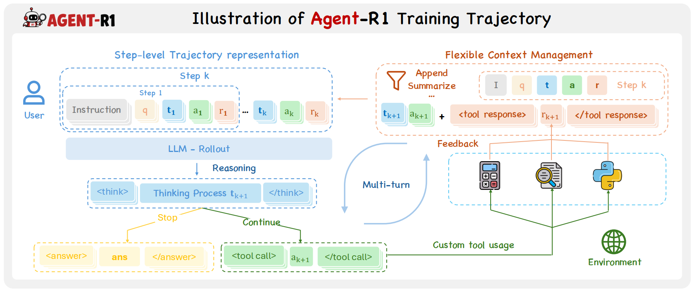
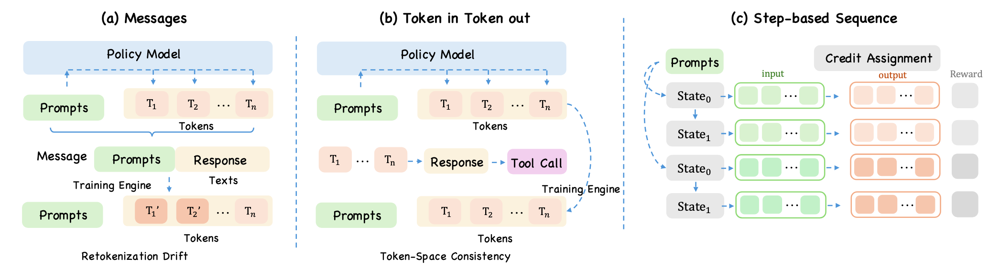

<h1 align="center">Agent-R1: Training Powerful LLM Agents with<br>End-to-End Reinforcement Learning</h1>

<p align="center">
  <a href="https://arxiv.org/abs/2511.14460"></a>
  <a href="https://agentr1.github.io/agent-r1/docs/"></a>
  <a href="https://deepwiki.com/AgentR1/Agent-R1"></a>
  <a href="https://github.com/AgentR1/Agent-R1/stargazers"></a>
  <a href="https://github.com/AgentR1/Agent-R1/network/members"></a>
</p>

<p align="center"></p>

**Agent-R1** is a unified, modular framework for **Agentic Reinforcement Learning**. It trains multi-step LLM agents through a step-native RL loop, where the model observes an environment, generates an action, receives tool or environment feedback, and continues until the task is solved or terminated.

Unlike single-turn RL pipelines that treat interaction as one growing prompt-response sequence, Agent-R1 models every turn as a **step-level MDP transition**. This makes tool use, environment state, context management, reward assignment, and policy optimization explicit parts of the same training substrate.

## News

- [2026.05.26] **Broader algorithm and benchmark support.** Agent-R1 now supports StepPO, RLOO, REINFORCE++ Baseline, and GiGPO in addition to GRPO, PPO, and REINFORCE++; beyond GSM8K-tool, it also includes HotpotQA, Paper Search, ALFWorld, and WebShop recipes.
- [2026.03.23] **Agent-R1 v0.1.0 is the first official release of the refactored architecture.** It introduces the **Step-level MDP** foundation and new **Layered Abstractions**. The previous implementation is archived on the `legacy` branch.
- [2026.03.04] **[Claw-R1](https://agentr1.github.io/Claw-R1/) is released.** It extends Agentic RL to general agents such as OpenClaw through a middleware-style design. See [AgentR1/Claw-R1](https://github.com/AgentR1/Claw-R1).

<details>
<summary><b>Earlier Updates</b></summary>

- [2026.01.10] **PaperScout** is released: an autonomous academic paper search agent trained with Agent-R1 and Proximal Sequence Policy Optimization. Read the paper [here](https://arxiv.org/abs/2601.10029).
- [2025.11.18] The Agent-R1 technical report is released on [arXiv](https://arxiv.org/abs/2511.14460).
- [2025.05.06] Tool environments are redesigned to support more flexible agent-tool interaction patterns.
- [2025.05.06] GRPO and REINFORCE++ training crashes caused by NaN values are fixed. See [issue #30](https://github.com/0russwest0/Agent-R1/issues/30).
- [2025.04.01] Basic inference scripts and an interactive chat interface are added.
- [2025.03.18] Multi-modal support is added for vision-language model agents.
- [2025.03.18] `verl` is moved to a git submodule and Agent-R1 extensions are separated from upstream code.
- [2025.03.16] Process rewards are supported for per-tool-call feedback.

</details>

## Why Agent-R1

Modern LLM infrastructure already has strong serving systems such as vLLM and SGLang, and strong distributed training systems such as DeepSpeed, FSDP, and Megatron-LM. Agentic RL needs to reconnect these two sides into a **rollout -> reward -> replay -> update** loop where the model interacts with tools and environments over multiple turns.

Agent-R1 is built around three design goals:

- **Step-level trajectory representation**: each transition stores observation, action, environment feedback, reward, termination state, and next observation while preserving action boundaries and avoiding fragile `Token -> Text -> Token` reconstruction.
- **Flexible context management**: the environment decides what the model sees next, so history can be appended, truncated, summarized, rewritten, or augmented.
- **Algorithm-system decoupling**: task workflows, environments, rollout, rewards, advantage estimators, and policy objectives can evolve independently.

<p align="center"></p>

## Core Idea: Step-level MDP

In multi-turn agent training, the model is not just continuing a token sequence. Each model output can invoke tools, change the environment state, receive external feedback, and shape the next observation. Agent-R1 therefore treats the **agent step** as the basic interaction unit: a step records what the model saw, what action it produced, what feedback and reward the environment returned, and what observation should be exposed next. This step-level trajectory representation keeps rollout, replay, context construction, and credit assignment aligned with real agent decisions, while still allowing token-level policy losses inside each generated action.

<p align="center"></p>

## Architecture

Agent-R1 uses layered abstractions so new tasks can reuse the same trainer without rewriting the full RL stack.

| Layer | Responsibility | When to Use |
|---|---|---|
| `AgentFlowBase` | Full control over prompt construction, model calls, and step assembly. | Custom workflows or experimental agent logic. |
| `AgentEnvLoop` | The main multi-step loop connecting model generation with environment `reset()` / `step()`. | Most agentic RL tasks. |
| `AgentEnv` | Task environment interface returning observations, rewards, termination, and metadata. | When your task has state transitions. |
| `ToolEnv` | Built-in environment for parsing tool calls, executing tools, and feeding observations back. | Tool-augmented tasks such as GSM8K-tool. |
| `BaseTool` | Standard interface for registering executable tools. | Adding calculators, search tools, APIs, or task-specific checkers. |

The main loop is:

1. Load a sample containing `prompt`, `agent_name`, `reward_model`, and optional `env_kwargs`.
2. Create the configured `AgentFlow` and environment.
3. Generate an action from the current observation.
4. Parse the action, execute tools or update the environment, and return feedback.
5. Record the step and continue until `done=True` or `max_steps` is reached.
6. Convert the structured trace into rewards, advantages, masks, and policy updates.

## Getting Started

Agent-R1 follows the environment setup of [verl](https://verl.readthedocs.io/en/latest/start/install.html). Use a recent source installation of `verl` that includes AgentFlow, async rollout, reward-loop, and `verl.trainer.config` package-data APIs.

Agent-R1 itself does not need a separate package install. Clone the repository, prepare a compatible `verl` environment, and run scripts from the repository root.

### Stage 1: Sanity Check with GSM8K-tool

Start with the smallest complete tool-use loop before moving to larger agent tasks:

```bash
python3 examples/data_preprocess/gsm8k_tool.py --local_save_dir ~/data/gsm8k_tool
bash examples/run_qwen3-4b_gsm8k_tool.sh
```

This checks the model path, dataset path, rollout engine, `AgentEnvLoop`, `ToolEnv`, tool execution, rewards, and trainer wiring.

You can append Hydra overrides directly:

```bash
bash examples/run_qwen3-4b_gsm8k_tool.sh \
  actor_rollout_ref.model.path=/path/to/Qwen3-4B \
  trainer.n_gpus_per_node=4
```

### Stage 2: Run Training

```bash
bash examples/run_qwen3-4b_gsm8k_tool.sh
bash examples/run_hotpotqa_grpo.sh
bash examples/run_papersearch_grpo.sh
bash examples/run_alfworld_grpo.sh
bash examples/run_webshop_grpo.sh
```

These scripts are a convenient way to verify that Agent-R1 can reuse the same training stack across different tasks, environments, tools, rewards, and data recipes.

## Datasets and Scripts

Agent-R1 is not tied to one benchmark. Current recipes cover math reasoning, multi-hop retrieval QA, academic paper search, text embodied environments, and web shopping.

| Dataset / Environment | Task Type | Training Script | Data Preparation |
|---|---|---|---|
| GSM8K Tool | Tool-augmented math reasoning | `examples/run_qwen3-4b_gsm8k_tool.sh` | `examples/data_preprocess/gsm8k_tool.py` |
| HotpotQA | Multi-hop retrieval QA | `examples/run_hotpotqa_grpo.sh` | `recipe/hotpotqa/prepare_hotpotqa_agent_r1.py` |
| Paper Search | Academic search agent | `examples/run_papersearch_grpo.sh` | `recipe/paper_search/prepare_paper_search_agent_r1.py` |
| ALFWorld | Text embodied household interaction | `examples/run_alfworld_grpo.sh` | `recipe/alfworld/prepare_alfworld_agent_r1.py` |
| WebShop | Simulated online shopping | `examples/run_webshop_grpo.sh` | `recipe/webshop/prepare_webshop_agent_r1.py` |

Data preparation examples:

```bash
# GSM8K Tool
python3 examples/data_preprocess/gsm8k_tool.py --local_save_dir ~/data/gsm8k_tool

# HotpotQA + retrieval corpus
python3 recipe/hotpotqa/prepare_hotpotqa_agent_r1.py \
  --output_dir data/corpus/hotpotqa \
  --corpus_output_path data/corpus/hotpotqa_corpus/hpqa_corpus.jsonl

# Paper Search from bundled AutoScholarQuery JSONL files
python3 recipe/paper_search/prepare_paper_search_agent_r1.py \
  --input_dir recipe/paper_search/inference/datasets/AutoScholarQuery \
  --output_dir data/pasa

# ALFWorld from local ALFWorld raw data
python3 recipe/alfworld/prepare_alfworld_agent_r1.py \
  --input_dir alfworld_data/json_2.1.1 \
  --output_dir data/alfworld

# WebShop small/full data
python3 recipe/webshop/prepare_webshop_agent_r1.py \
  --dataset_mode small \
  --input_dir webshop_data \
  --output_dir data/webshop
```

Paper Search raw JSONL files are included under `recipe/paper_search/inference/datasets/`. Larger generated artifacts such as parquet files, retrieval indexes, environment caches, and copied game or product data should stay local under `data/`.

## Training Data Contract

Agent-R1 uses parquet files compatible with the `verl` trainer. Agent tasks normally include:

| Field | Required | Meaning |
|---|---:|---|
| `data_source` | Yes | Dataset or benchmark name. |
| `prompt` | Yes | Chat messages passed to the tokenizer and rollout engine. |
| `ability` | Recommended | Task category used for logging and reward routing. |
| `reward_model` | Yes | Rule/model reward metadata, usually including `ground_truth`. |
| `extra_info` | Recommended | Split, index, raw question, raw answer, or task-specific metadata. |
| `agent_name` | Agent tasks | Agent flow name, usually `agent_env_loop`. |
| `env_kwargs` | Tool/env tasks | JSON config consumed by `AgentEnvLoop._create_env`. |

Minimal `env_kwargs` for GSM8K-tool:

```json
{
  "env_type": "tool",
  "tools": ["calc_gsm8k_reward"],
  "tool_format": "hermes",
  "tools_kwargs": {"ground_truth": "<answer>"}
}
```

## Supported Algorithms

The trainer routes `algorithm.adv_estimator` to multiple estimators:

| Method | Configuration | Granularity | Critic Required |
|---|---|---|---:|
| StepPO | `adv_estimator=gae` + `loss_mode=gspo` | Step-level advantage + sequence-level policy loss | Yes |
| GRPO | `algorithm.adv_estimator=grpo` | Trajectory / group-relative | No |
| PPO / GAE | `algorithm.adv_estimator=gae` | Step-level actor-critic | Yes |
| RLOO | `algorithm.adv_estimator=rloo` | Trajectory outcome | No |
| REINFORCE++ | `algorithm.adv_estimator=reinforce_plus_plus` | Token return | No |
| REINFORCE++ Baseline | `algorithm.adv_estimator=reinforce_plus_plus_baseline` | Prompt / trajectory baseline | No |
| GiGPO | `algorithm.adv_estimator=gigpo` | Trajectory + step group | No |

`actor_rollout_ref.actor.policy_loss.loss_mode` controls the policy objective separately from advantage estimation. This separation makes it easier to compare credit-assignment strategies under the same environment and rollout setup.

## Experimental Snapshot

The Agent-R1 report evaluates Qwen3-4B across representative agent scenarios. The table below summarizes the main results; see [Experiments](docs/experiments.md) for the experimental setting, task coverage, optimizer comparison, and context-management analysis.

| Method | GSM8K Acc. (%) | HotpotQA Acc. (%) | ALFWorld SR Seen (%) | ALFWorld SR Unseen (%) | WebShop Score (%) | WebShop SR (%) |
|---|---:|---:|---:|---:|---:|---:|
| ReAct | 53.1 | 25.8 | 7.14 | 2.98 | 51.58 | 23.8 |
| GRPO | **83.3** | **59.4** | **81.29** | **74.58** | 65.83 | 44.2 |
| PPO | 78.1 | 56.7 | 76.42 | 72.38 | **70.18** | **46.0** |
| REINFORCE++ | 78.9 | 52.8 | 73.84 | 69.57 | 63.41 | 41.8 |
| RLOO | 81.6 | 55.2 | 79.08 | 73.46 | 68.02 | 45.1 |

## Building a New Agent Task

For a new task, keep the trainer intact and implement the task-specific layers:

```text
recipe/<task>/
  base.yaml
  prepare_<task>_agent_r1.py
  <task>_agent_flow.py
  reward_fn.py
  prompts.py
  utils.py
  env/                       # optional environment service or wrappers
```

Typical migration checklist:

- **Data**: emit parquet rows with `prompt`, `reward_model`, `agent_name`, and `env_kwargs`.
- **Environment / tools**: define how state updates, tool observations, rewards, and termination work.
- **Agent flow**: connect model actions to the environment loop and expose step records.
- **Training script**: set paths, rollout steps, batch sizes, estimator, and policy loss through Hydra overrides.

See:

- [Step-level MDP](docs/core-concepts/step-level-mdp.md)
- [Layered Abstractions](docs/core-concepts/layered-abstractions.md)
- [Agent Task Tutorial](docs/tutorials/agent-task.md)
- [Datasets and Algorithms](docs/tutorials/datasets-and-algorithms.md)

## Documentation

- Project homepage: [https://agentr1.github.io/agent-r1](https://agentr1.github.io/agent-r1)
- Documentation: [https://agentr1.github.io/agent-r1/docs/](https://agentr1.github.io/agent-r1/docs/)

## Version Guide

- `main` contains the current v0.1.0 architecture based on Step-level MDP and layered abstractions.
- `legacy` preserves the previous implementation for reference.
- Use a recent source checkout of `verl` that includes the AgentFlow / async rollout stack required by this repository.

## Awesome Projects Using Agent-R1

- **[TableMind](https://arxiv.org/abs/2509.06278)**: an autonomous programmatic agent for tool-augmented table reasoning.
- **[PaperScout](https://arxiv.org/abs/2601.10029)**: an autonomous academic paper search agent trained with Agent-R1 and Proximal Sequence Policy Optimization.
- **[Cast-R1](https://arxiv.org/abs/2602.13802)**: an agentic framework that reformulates time-series forecasting as sequential decision making.
- **[StepPO](https://arxiv.org/pdf/2604.18401)**: Step-Aligned Policy Optimization for Agentic Reinforcement Learning, a step-level Agentic RL method that treats the agent step as the action unit and aligns credit assignment with multi-turn agent decisions.

## Acknowledgements

This work is conducted at the **State Key Laboratory of Cognitive Intelligence, USTC**. We gratefully acknowledge the ideas and infrastructure from [DeepSeek-R1](https://github.com/deepseek-ai/DeepSeek-R1), [veRL](https://github.com/volcengine/verl), and [RAGEN](https://github.com/ZihanWang314/ragen). We also thank [Prof. Qi Liu](http://staff.ustc.edu.cn/~qiliuql/) and [Prof. Mingyue Cheng](https://mingyue-cheng.github.io/) for their guidance and support.

## Citation

If you find Agent-R1 useful in your research, please cite:

```bibtex
@misc{cheng2025agentr1trainingpowerfulllm,
  title={Agent-R1: Training Powerful LLM Agents with End-to-End Reinforcement Learning},
  author={Mingyue Cheng and Jie Ouyang and Shuo Yu and Ruiran Yan and Yucong Luo and Zirui Liu and Daoyu Wang and Qi Liu and Enhong Chen},
  year={2025},
  eprint={2511.14460},
  archivePrefix={arXiv},
  primaryClass={cs.CL},
  url={https://arxiv.org/abs/2511.14460}
}
```

## Star History

[](https://www.star-history.com/#AgentR1/Agent-R1&Date)
