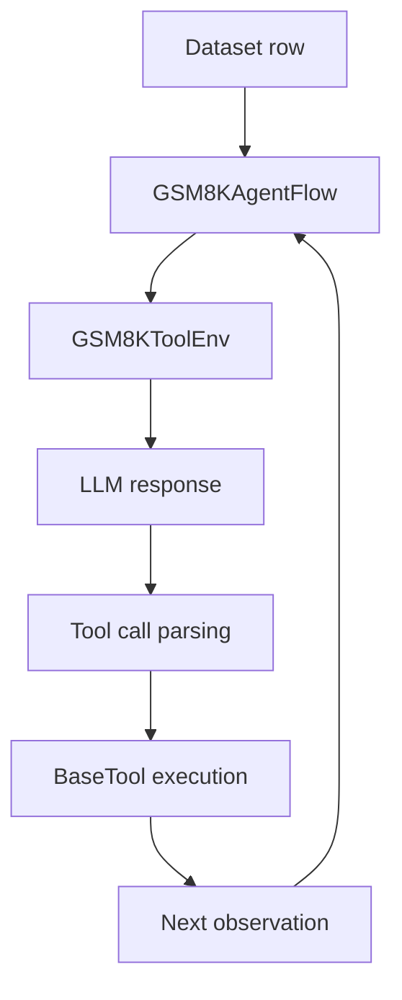

# 智能体任务教程

本教程展示 Agent-R1 的主要路径：一个基于 recipe-local agent flow 和环境实现的 **多步、工具增强智能体任务**。

示例使用 GSM8K，但重点不是这个 benchmark 本身，而是展示 Agent-R1 如何把一行数据变成环境驱动的多步 rollout。

## 你将运行什么

本教程使用两个已有文件：

- 数据预处理：[`recipes/gsm8k/data_preprocess/process_gsm8k_agent.py`](https://github.com/AgentR1/Agent-R1/blob/main/recipes/gsm8k/data_preprocess/process_gsm8k_agent.py)
- 训练脚本：[`examples/gsm8k/run_grpo.sh`](https://github.com/AgentR1/Agent-R1/blob/main/examples/gsm8k/run_grpo.sh)

## 1. 准备智能体数据集

生成工具增强的 GSM8K 数据：

```bash
python3 -m recipes.gsm8k.data_preprocess.process_gsm8k_agent --local_save_dir ~/data/gsm8k_agent
```

相比单步 sanity-check 数据，这个预处理脚本会为 agent path 保留结构化任务字段：

- `agent_name: "gsm8k_agent"`
- `question` 和 `ground_truth`，让 recipe 环境可以在 rollout 时动态构建 prompt
- `env_kwargs`，用于保存每个样本的工具元数据，例如 ground-truth answer

概念上，每个样本会表达：

1. 使用 recipe-local `gsm8k_agent` rollout 逻辑
2. 实例化 GSM8K tool environment
3. 在环境中暴露 `calc_gsm8k_reward` 工具

## 2. 启动智能体训练脚本

运行：

```bash
bash examples/gsm8k/run_grpo.sh
```

这个脚本会把 rollout 从单步生成切换到 agent loop：

```bash
actor_rollout_ref.rollout.agent.default_agent_flow=gsm8k_agent \
actor_rollout_ref.rollout.agent.max_steps=5 \
```

同时，它会把 trainer 指向 agent 数据集：

```bash
data.train_files=$HOME/data/gsm8k_agent/train.parquet \
data.val_files=$HOME/data/gsm8k_agent/test.parquet \
```

## 3. 一条轨迹中会发生什么

从高层看，一个样本会经过以下路径：



更具体地说：

1. `GSM8KAgentFlow` 读取 recipe defaults 和每个样本的 `env_kwargs`。
2. `AgentEnv.from_config(env_type="gsm8k_agent", ...)` 创建 `GSM8KToolEnv`。
3. `GSM8KToolEnv.reset()` 根据 `question` 和 `ground_truth` 构建 prompt messages。
4. LLM 生成回复。
5. `ToolEnv.step()` 从回复中解析工具调用，并执行注册工具。
6. 工具输出会作为下一步 observation 加入对话。
7. 循环持续到环境返回 `done=True` 或达到 `max_steps`。

## 4. 奖励来自哪里

内置 GSM8K 工具在 `agent_r1/tool/tools/gsm8k.py` 中注册为 `calc_gsm8k_reward`。

它在这个示例中的作用是：

- 接收模型提出的答案
- 与样本 ground truth 比较
- 将工具文本返回到对话中

这正是本教程对 Agent-R1 有价值的地方：模型不只是生成一个最终答案，而是在可以评估并反馈信息的环境中进行多步交互。

## 5. 为什么这个教程比单步脚本更重要

单步 GSM8K 脚本仍然有用，但它主要是 setup check。本教程更接近 Agent-R1 的设计中心，因为它展示了：

- step-level 环境转移
- 多步 agent loop
- 工具增强交互
- 与环境调解行为绑定的奖励信号

## 6. 接下来阅读

- 阅读 [`Step-level MDP`](../core-concepts/step-level-mdp.md)，将本教程与核心 RL formulation 对齐。
- 阅读 [`分层抽象`](../core-concepts/layered-abstractions.md)，理解这个示例为什么自然对应 `AgentEnvLoop + ToolEnv`。
- 阅读 [`Recipes 与算法`](recipes-and-algorithms.md)，查看其他任务 recipe 和启动脚本。
